# Authentication, Redirects, and Comments Flow

This document provides a comprehensive overview of how authentication, redirects, and comments work in the TanStack Start + Strapi application.

## Table of Contents
- [Authentication Flow](#authentication-flow)
- [Redirect Logic](#redirect-logic)
- [Comment System Flow](#comment-system-flow)

---

## Authentication Flow

### Login/Registration Flow

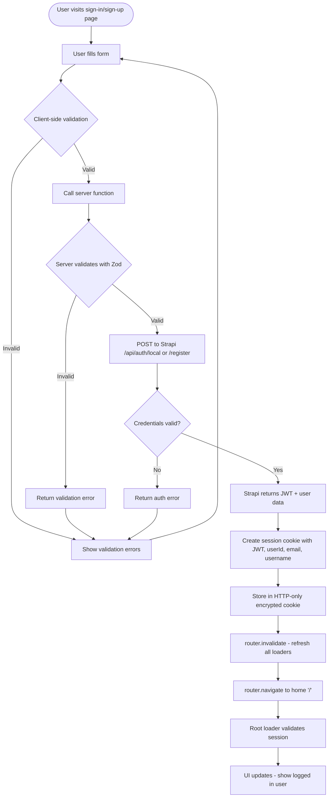

### OAuth (Social Login) Flow

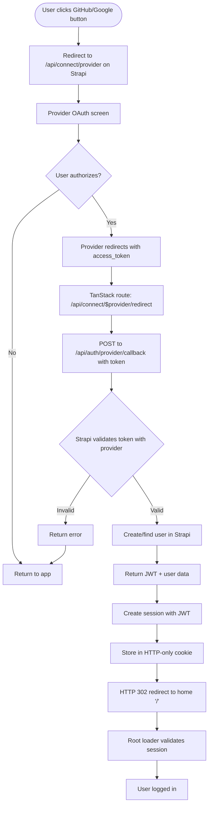

### JWT Validation Flow (useMe endpoint)

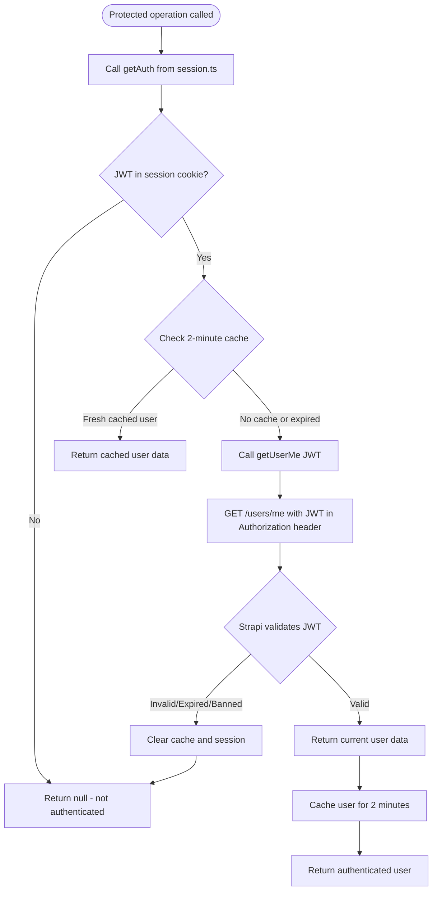

### Session Management Architecture

```mermaid
flowchart LR
    subgraph Client["TanStack Start Client"]
        UI[UI Components]
        ServerFunc[Server Functions]
    end

    subgraph Session["Session Layer"]
        Cookie[HTTP-only encrypted cookie]
        Cache[2-minute in-memory cache]
        GetAuth[getAuth function]
    end

    subgraph Strapi["Strapi Backend"]
        AuthAPI[/api/auth endpoints]
        UsersMeAPI[/users/me endpoint]
        JWT[JWT validation]
    end

    UI -->|Login/Register| ServerFunc
    ServerFunc -->|Validate| GetAuth
    GetAuth -->|Read| Cookie
    GetAuth -->|Check| Cache

    GetAuth -->|If not cached| UsersMeAPI
    UsersMeAPI -->|Validate| JWT
    JWT -->|Return user| GetAuth
    GetAuth -->|Cache result| Cache

    ServerFunc -->|Auth endpoints| AuthAPI
    AuthAPI -->|Return JWT| ServerFunc
    ServerFunc -->|Store| Cookie
```

---

## Redirect Logic

### Redirect Flow After Authentication

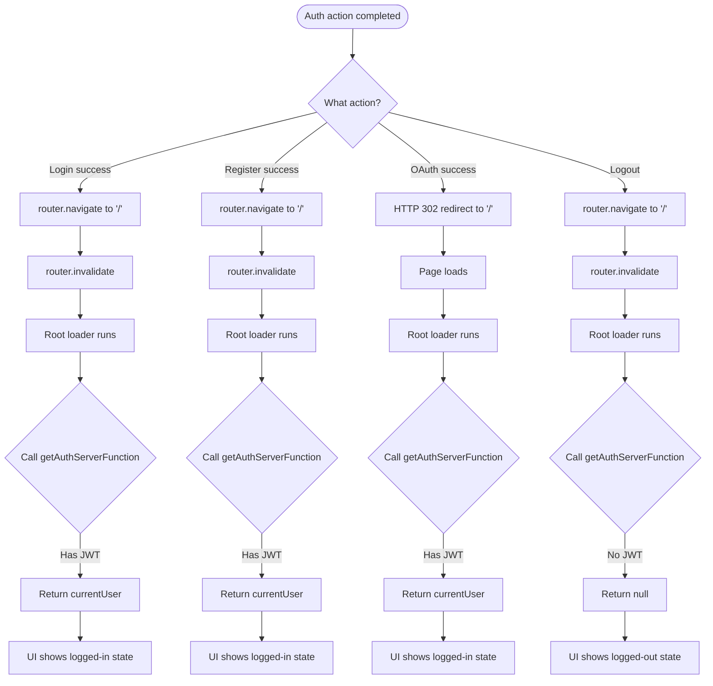

### Route Protection (Currently No Automatic Protection)

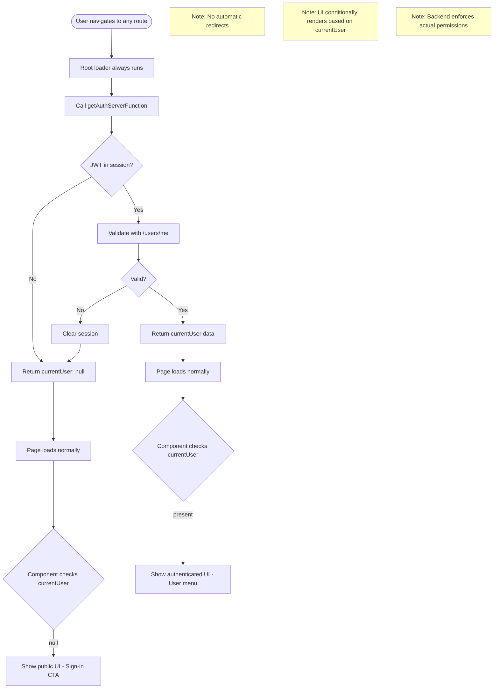

### Current Redirect Destinations

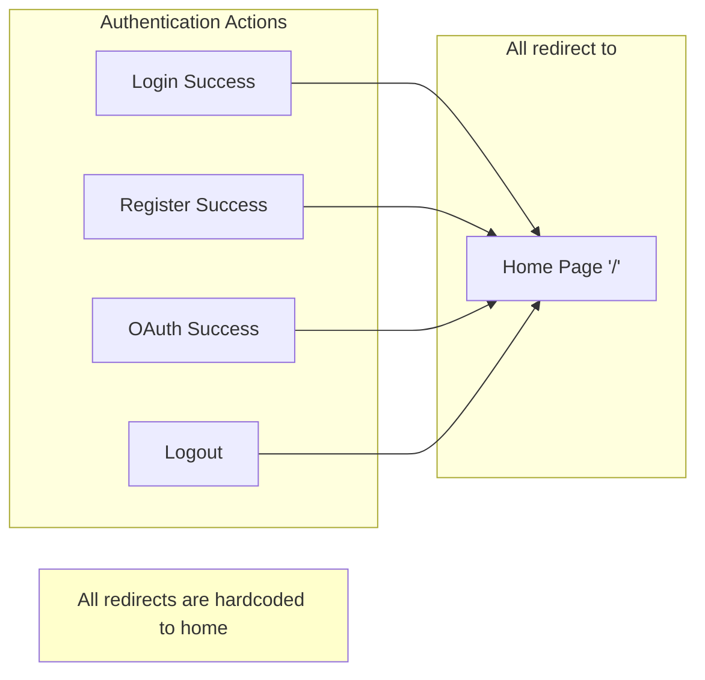

---

## Comment System Flow

### Comment Creation Flow

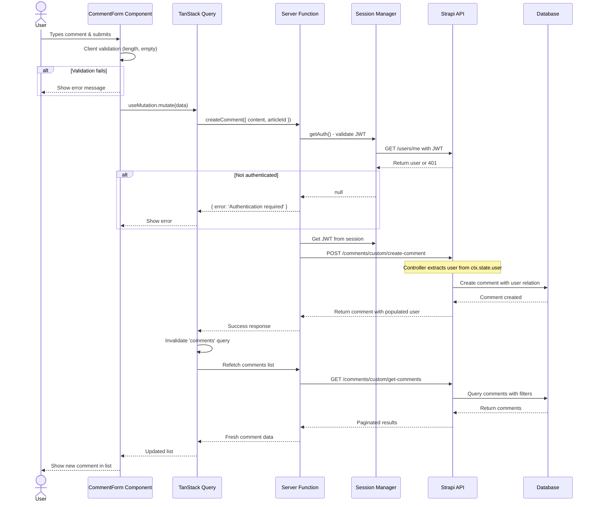

### Comment Display & Pagination Flow

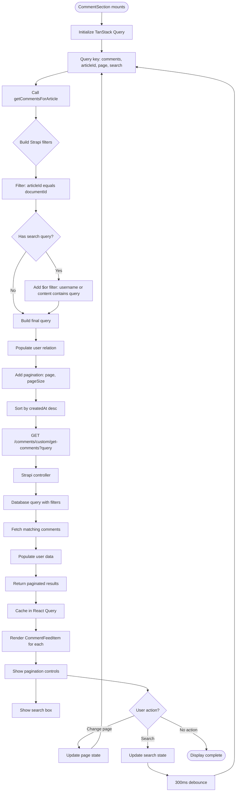

### Comment Update Flow

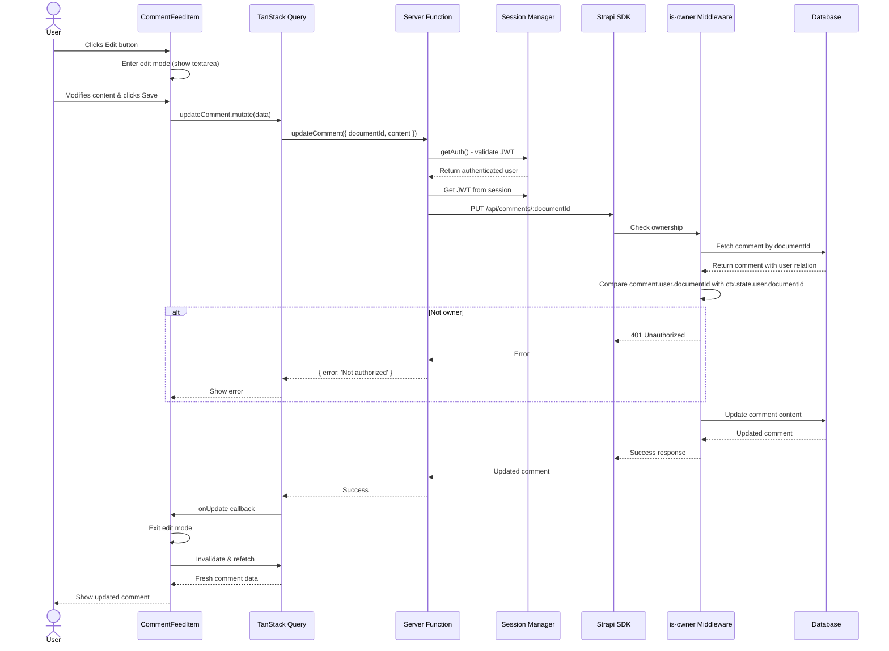

### Comment Delete Flow

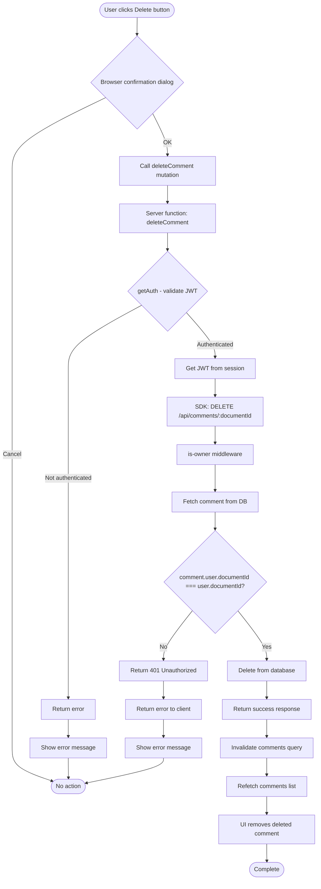

### Comment System Architecture

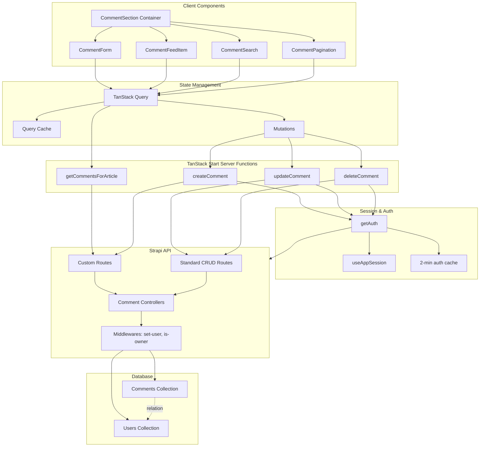

### Comment Data Flow Summary

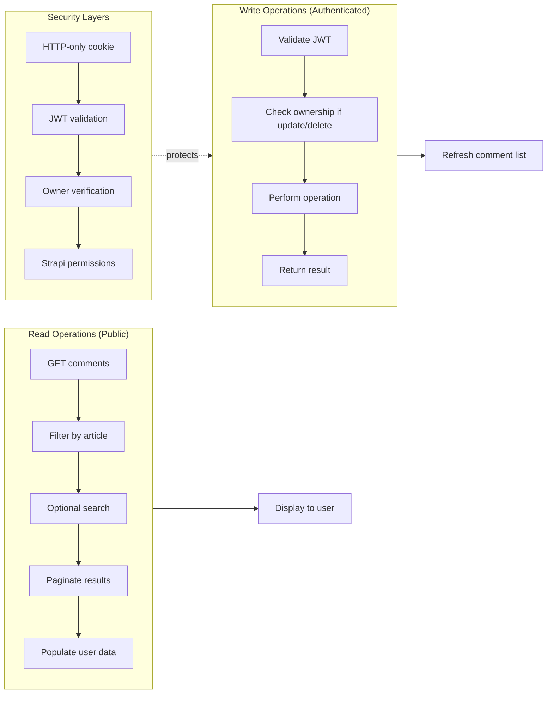

---

## Key Files Reference

### Authentication Files
- **Session Management:** `client/src/lib/session.ts`
- **Server Functions:** `client/src/data/server-functions/auth.ts`
- **Auth Services:** `client/src/lib/services/auth.ts`
- **Strapi SDK:** `client/src/data/strapi-sdk.ts`
- **Sign-in Page:** `client/src/routes/_auth/signin.tsx`
- **Sign-up Page:** `client/src/routes/_auth/signup.tsx`
- **OAuth Handler:** `client/src/routes/api.connect.$provider.redirect.tsx`

### Redirect Files
- **Root Loader:** `client/src/routes/__root.tsx`
- **Navigation:** `client/src/components/custom/top-navigation.tsx`
- **Logout Button:** `client/src/components/custom/logout-button.tsx`

### Comment Files
- **Main Component:** `client/src/components/custom/comment-section/index.tsx`
- **Comment Form:** `client/src/components/custom/comment-section/comment-form.tsx`
- **Comment Item:** `client/src/components/custom/comment-section/comment-feed-item.tsx`
- **Server Functions:** `client/src/data/server-functions/comments.ts`
- **Strapi Controller:** `server/src/api/comment/controllers/comment.ts`
- **Strapi Routes:** `server/src/api/comment/routes/`
- **Middlewares:** `server/src/api/comment/middlewares/` and `server/src/middlewares/is-owner.ts`

---

## Security Features

### Authentication Security
1. **HTTP-only cookies** - JavaScript cannot access JWT
2. **Encrypted sessions** - Uses SESSION_SECRET for encryption
3. **JWT validation** - Every protected operation validates with Strapi's /users/me
4. **2-minute cache** - Balances security and performance
5. **HTTPS in production** - Secure cookies in production mode
6. **CSRF protection** - sameSite: 'lax' cookie policy

### Comment Security
1. **Owner verification** - is-owner middleware on update/delete
2. **User auto-assignment** - set-user middleware prevents impersonation
3. **Backend enforcement** - Permissions enforced by Strapi, not client
4. **Input validation** - Content length limits and required fields
5. **Auth checks** - All write operations require valid JWT

---

## Data Structures

### Session Data
```typescript
{
  userId?: number,
  email?: string,
  username?: string,
  jwt?: string
}
```

### Comment Data
```typescript
{
  id: number,
  documentId: string,
  content: string,
  articleId: string,
  user?: {
    id: number,
    documentId: string,
    username: string,
    email: string
  },
  createdAt: string,
  updatedAt: string
}
```

### Auth User Data
```typescript
{
  id: number,
  documentId: string,
  username: string,
  email: string,
  provider?: string,
  confirmed?: boolean,
  blocked?: boolean
}
```
