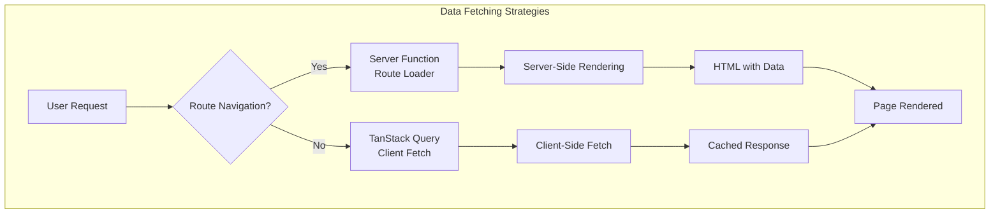
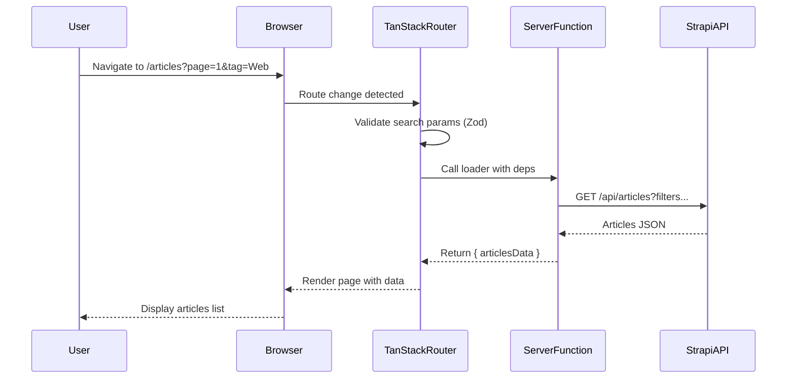
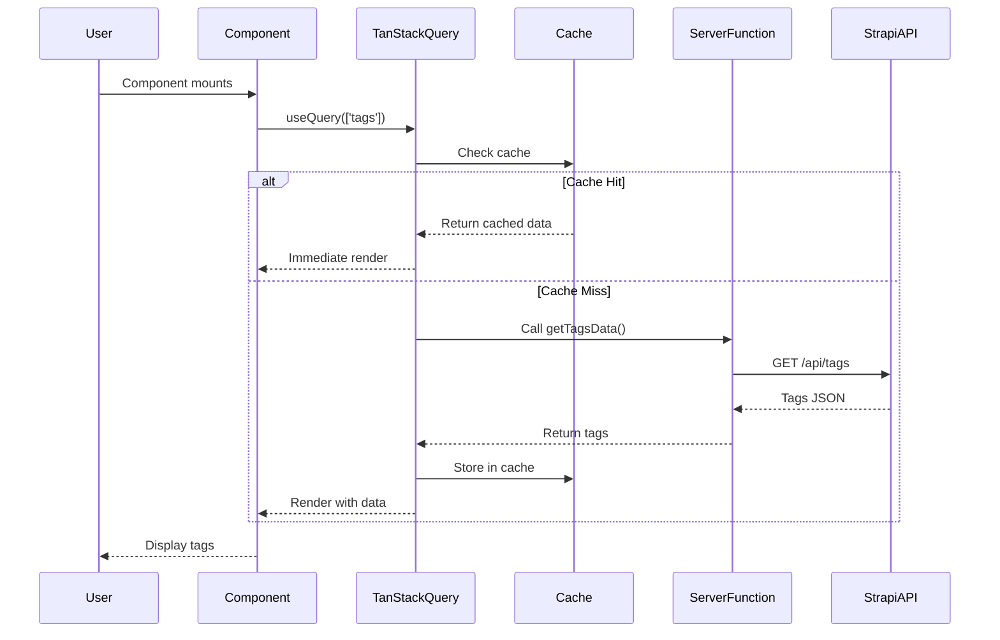
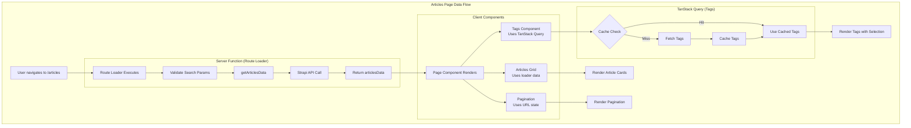
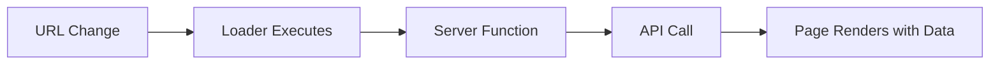
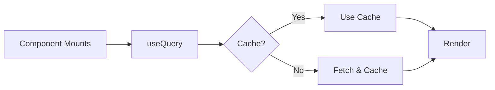
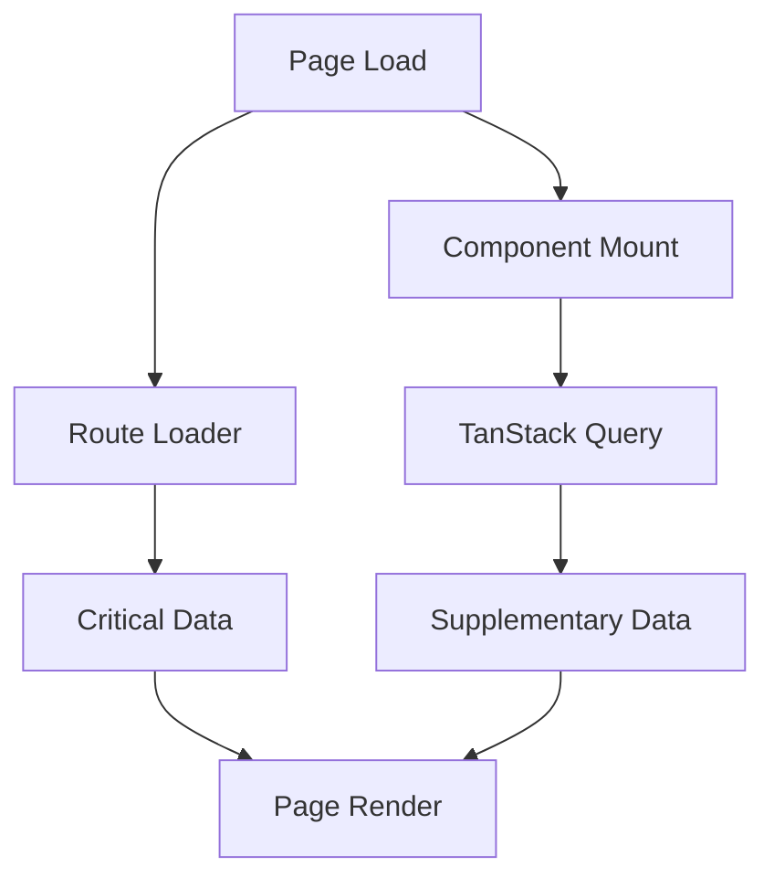
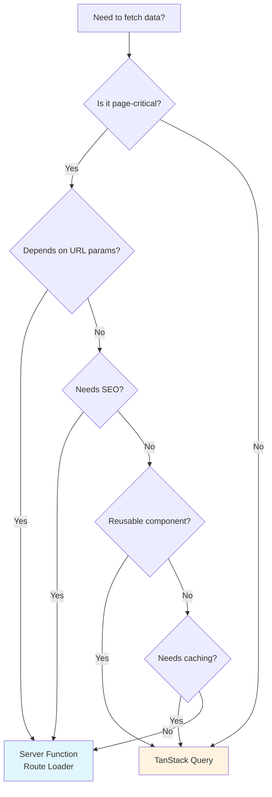

# Data Fetching Patterns: Server Functions vs TanStack Query

This document explains the two primary data fetching patterns used in this project: **TanStack Start Server Functions** (route loaders) and **TanStack Query** (client-side). Understanding when to use each pattern is crucial for building performant and maintainable applications.

## Table of Contents

- [Overview](#overview)
- [Architecture Diagrams](#architecture-diagrams)
- [Server Functions (Route Loaders)](#server-functions-route-loaders)
- [TanStack Query (Client-Side)](#tanstack-query-client-side)
- [Comparison Table](#comparison-table)
- [Best Practices](#best-practices)
- [Recommended Patterns](#recommended-patterns)
- [Real Examples from This Project](#real-examples-from-this-project)

---

## Overview

This project uses two complementary data fetching strategies:

1. **Server Functions with Route Loaders** - Data fetched on the server before the page renders
2. **TanStack Query** - Data fetched on the client with caching, background updates, and state management



---

## Architecture Diagrams

### Server Function Flow (Route Loader Pattern)

Used for **critical page data** that must be available before render.



### TanStack Query Flow (Client-Side Pattern)

Used for **reusable components** that fetch their own data independently.



### Combined Pattern in Articles Page

This diagram shows how both patterns work together on the `/articles` page.



---

## Server Functions (Route Loaders)

### What Are Server Functions?

Server Functions in TanStack Start are functions that run on the server and can be called from route loaders. They use `createServerFn` to define server-side logic.

### When to Use

- **Critical page data** - Data required for the initial page render
- **SEO-sensitive content** - Content that search engines need to index
- **URL-dependent data** - Data that changes based on URL parameters
- **Authenticated requests** - Server-side auth token handling

### Implementation

```typescript
// server-functions/articles.ts
import { createServerFn } from '@tanstack/react-start'

export const getArticlesData = createServerFn({
  method: 'GET',
})
  .inputValidator((input?: { query?: string; page?: number; tag?: string }) => input)
  .handler(async ({ data }): Promise<TStrapiResponseCollection<IArticleDetail>> => {
    const response = await getArticles(data?.query, data?.page, data?.tag)
    return response
  })
```

```typescript
// routes/articles/index.tsx
export const Route = createFileRoute('/articles/')({
  validateSearch: articlesSearchSchema,
  loaderDeps: ({ search }) => ({ search }),
  loader: async ({ deps }) => {
    const { query, page, tag } = deps.search
    const articlesData = await strapiApi.articles.getArticlesData({
      data: { query, page, tag },
    })
    return { articlesData }
  },
  component: Articles,
})

function Articles() {
  const { articlesData } = Route.useLoaderData()
  // Data is immediately available, no loading state needed
}
```

### Pros

| Advantage | Description |
|-----------|-------------|
| **SSR Support** | Data available on first render, better SEO |
| **No Loading States** | Page renders with data already loaded |
| **URL Synchronization** | Automatic re-fetch when URL params change |
| **Type Safety** | Full TypeScript support with Zod validation |
| **Secure** | API keys and secrets stay on server |

### Cons

| Disadvantage | Description |
|--------------|-------------|
| **Route Coupling** | Data fetching tied to specific routes |
| **No Client Caching** | Each navigation re-fetches data |
| **Waterfall Requests** | Sequential loading can slow page loads |
| **Less Reusable** | Components can't fetch their own data |

---

## TanStack Query (Client-Side)

### What Is TanStack Query?

TanStack Query is a powerful data fetching library that provides caching, background updates, stale-while-revalidate, and more.

### When to Use

- **Reusable components** - Components used across multiple pages
- **Independent data** - Data not tied to URL parameters
- **Frequently updated data** - Data that benefits from background refetching
- **User interactions** - Data fetched in response to user actions

### Implementation

```typescript
// components/custom/tags.tsx
import { useQuery } from '@tanstack/react-query'
import { strapiApi } from '@/data/server-functions'

export function Tags({ className }: TagsProps) {
  const { data, isLoading, error } = useQuery({
    queryKey: ['tags'],
    queryFn: () => strapiApi.tags.getTagsData(),
  })

  if (isLoading) {
    return <div>Loading tags...</div>
  }

  if (error) {
    return <div>Failed to load tags</div>
  }

  const tags = data?.data ?? []
  // Render tags...
}
```

### Pros

| Advantage | Description |
|-----------|-------------|
| **Automatic Caching** | Data cached and reused across components |
| **Background Updates** | Stale data shown while fresh data loads |
| **Reusable Components** | Components fetch their own data anywhere |
| **Loading/Error States** | Built-in state management |
| **Deduplication** | Multiple components share same request |
| **Offline Support** | Works with cached data when offline |

### Cons

| Disadvantage | Description |
|--------------|-------------|
| **Initial Loading** | Shows loading state on first render |
| **SEO Limitations** | Client-fetched data not in initial HTML |
| **Complexity** | Additional library and concepts to learn |
| **Hydration Mismatch** | Can cause issues with SSR if not careful |

---

## Comparison Table

| Feature | Server Functions (Loader) | TanStack Query |
|---------|--------------------------|----------------|
| **Execution** | Server-side | Client-side |
| **Initial Render** | Data available immediately | Shows loading state |
| **SEO** | Excellent | Limited |
| **Caching** | None (re-fetches on navigation) | Automatic with TTL |
| **Reusability** | Route-specific | Component-level |
| **URL Sync** | Automatic with `loaderDeps` | Manual handling |
| **Loading States** | Not needed | Built-in |
| **Error Handling** | Route error boundaries | Per-component |
| **Background Refetch** | No | Yes |
| **Offline Support** | No | Yes |
| **Best For** | Page-level critical data | Reusable components |

---

## Best Practices

### 1. Use Server Functions for Route-Critical Data

```typescript
// Good: Articles list depends on URL params
export const Route = createFileRoute('/articles/')({
  loaderDeps: ({ search }) => ({ search }),
  loader: async ({ deps }) => {
    return await strapiApi.articles.getArticlesData({ data: deps.search })
  },
})
```

### 2. Use TanStack Query for Reusable Components

```typescript
// Good: Tags component can be used anywhere
export function Tags() {
  const { data } = useQuery({
    queryKey: ['tags'],
    queryFn: () => strapiApi.tags.getTagsData(),
  })
  // Component is self-contained and reusable
}
```

### 3. Combine Both Patterns When Appropriate

```typescript
// Articles page: Server function for articles, Query for tags
function Articles() {
  // Critical data from loader
  const { articlesData } = Route.useLoaderData()

  return (
    <>
      {/* Tags fetches its own data via TanStack Query */}
      <Tags />

      {/* Articles use loader data */}
      <ArticleGrid articles={articlesData.data} />
    </>
  )
}
```

### 4. Define Query Keys Consistently

```typescript
// Use consistent, hierarchical query keys
const queryKeys = {
  tags: ['tags'] as const,
  articles: ['articles'] as const,
  article: (slug: string) => ['articles', slug] as const,
  comments: (articleId: string) => ['comments', articleId] as const,
}
```

### 5. Handle Loading and Error States Gracefully

```typescript
export function Tags() {
  const { data, isLoading, error } = useQuery({
    queryKey: ['tags'],
    queryFn: () => strapiApi.tags.getTagsData(),
  })

  if (isLoading) {
    return <TagsSkeleton /> // Show skeleton, not spinner
  }

  if (error) {
    return <TagsError onRetry={() => refetch()} />
  }

  return <TagsList tags={data?.data ?? []} />
}
```

### 6. Leverage Server Functions Inside TanStack Query

```typescript
// TanStack Query calls the same server function
const { data } = useQuery({
  queryKey: ['tags'],
  queryFn: () => strapiApi.tags.getTagsData(), // Server function!
})
```

This gives you the security benefits of server functions with the caching benefits of TanStack Query.

---

## Recommended Patterns

### Pattern 1: Route Loader for Page Data

**Use when:** Data is essential for page render and tied to URL.



### Pattern 2: TanStack Query for Reusable Components

**Use when:** Component needs to work independently across pages.



### Pattern 3: Hybrid Approach

**Use when:** Page has both critical and supplementary data.



---

## Real Examples from This Project

### Example 1: Articles Page (Server Function)

**File:** `routes/articles/index.tsx`

The articles list uses a server function because:
- Data depends on URL search params (`query`, `page`, `tag`)
- SEO requires articles in initial HTML
- Pagination needs URL synchronization

```typescript
export const Route = createFileRoute('/articles/')({
  validateSearch: z.object({
    query: z.string().optional(),
    page: z.number().default(1),
    tag: z.string().optional(),
  }),
  loaderDeps: ({ search }) => ({ search }),
  loader: async ({ deps }) => {
    const { query, page, tag } = deps.search
    const articlesData = await strapiApi.articles.getArticlesData({
      data: { query, page, tag },
    })
    return { articlesData }
  },
})
```

### Example 2: Tags Component (TanStack Query)

**File:** `components/custom/tags.tsx`

The tags component uses TanStack Query because:
- Can be placed on any page
- Data doesn't change based on URL
- Benefits from caching across navigations
- Needs independent loading/error states

```typescript
export function Tags({ className }: TagsProps) {
  const { data, isLoading, error } = useQuery({
    queryKey: ['tags'],
    queryFn: () => strapiApi.tags.getTagsData(),
  })

  // Self-contained loading and error handling
  if (isLoading) return <div>Loading tags...</div>
  if (error) return <div>Failed to load tags</div>

  // Component manages its own state and rendering
  return (
    <div className={cn('flex flex-wrap gap-2', className)}>
      {/* Tag badges with selection */}
    </div>
  )
}
```

### Data Flow Summary

```mermaid
flowchart TB
    subgraph "Server Functions Layer"
        SF1[getArticlesData]
        SF2[getTagsData]
        SF3[getArticlesDataBySlug]
    end

    subgraph "Route Loaders"
        RL1[/articles loader]
        RL2[/articles/$slug loader]
    end

    subgraph "TanStack Query"
        TQ1[Tags Component]
    end

    subgraph "Strapi API"
        API[Strapi Backend]
    end

    RL1 --> SF1
    RL2 --> SF3
    TQ1 --> SF2

    SF1 --> API
    SF2 --> API
    SF3 --> API
```

---

## Decision Flowchart

Use this flowchart to decide which pattern to use:



---

## Summary

| Scenario | Recommended Approach |
|----------|---------------------|
| Page requires data before render | Server Function (Route Loader) |
| Data tied to URL parameters | Server Function (Route Loader) |
| SEO-critical content | Server Function (Route Loader) |
| Reusable component across pages | TanStack Query |
| Data benefits from caching | TanStack Query |
| Component needs loading states | TanStack Query |
| Mix of critical + supplementary | Both (Hybrid) |

By using both patterns strategically, you get the best of both worlds: fast initial page loads with SSR data, and efficient client-side caching for reusable components.
